# Scheduler 主循环函数调用关系图

下图按主循环执行顺序展示 [Scheduler 如何从 ZMQ 拿请求并跑推理](scheduler-recv-and-run.zh.md) 章节涉及的所有函数及其调用关系。**每个节点都是可点击链接**,点进去就是对应的解析文章。

```mermaid
flowchart TD
    classDef entry fill:#fde7b3,stroke:#c47b00,color:#000,font-weight:bold
    classDef recv fill:#cfe7ff,stroke:#1f6fbf,color:#000
    classDef sched fill:#d8f1d8,stroke:#2f8a2f,color:#000
    classDef forward fill:#ffd8d8,stroke:#b13c3c,color:#000
    classDef output fill:#e8d8ff,stroke:#6a3fbf,color:#000
    classDef topic fill:#f5f5f5,stroke:#888,color:#000,stroke-dasharray:4 3

    A[event_loop_normal / overlap<br/>主循环 while True]:::entry

    A --> B[recv_requests<br/>从 ZMQ 拉请求 + 跨 rank 广播]:::recv
    A --> C[process_input_requests<br/>类型派发到具体 handler]:::recv

    C --> D[handle_generate_request<br/>构造 Req,处理 session/multimodal/grammar]:::recv
    D --> E[_add_request_to_queue<br/>按 disagg 模式入队 + 触发 KV 预取]:::recv

    A --> F[get_next_batch_to_run<br/>调度内核:决定本轮 batch]:::sched
    F --> G[get_new_batch_prefill<br/>从 waiting_queue 组 prefill batch]:::sched
    F --> H[update_running_batch<br/>清 finished + retract + prepare decode]:::sched

    A --> I[run_batch<br/>worker.forward_batch_generation]:::forward
    I --> I2[forward_batch_generation<br/>ForwardBatch.init_new → model.forward → sample]:::forward

    A --> J[process_batch_result<br/>按 forward_mode 5 路分派]:::output
    J --> K[stream_output / stream_output_generation<br/>BatchTokenIDOutput 推给 detokenizer]:::output

    %% Loop edge
    K -.下一轮回到主循环.-> A

    %% Conceptual deep-dive topics (虚线表示「关联阅读」)
    F -. 概念深入.-> Z1[get_next_batch_to_run 深度解读<br/>三状态关系 / chunked_req 生命周期]:::topic
    F -. PP 下分歧.-> Z2[self.chunked_req vs last_batch.chunked_req]:::topic

    %% click bindings (GitHub Mermaid supports relative links)
    click A "scheduler-recv-and-run.zh.md" "Scheduler 如何从 ZMQ 拿请求并跑推理"
    click B "scheduler-recv-requests.zh.md" "recv_requests 解析"
    click C "scheduler-process-input-requests.zh.md" "process_input_requests 解析"
    click D "scheduler-handle-generate-request.zh.md" "handle_generate_request 解析"
    click E "scheduler-add-request-to-queue.zh.md" "_add_request_to_queue 解析"
    click F "scheduler-get-next-batch-to-run.zh.md" "get_next_batch_to_run 解析"
    click G "scheduler-get-new-batch-prefill.zh.md" "get_new_batch_prefill 解析"
    click H "scheduler-update-running-batch.zh.md" "update_running_batch 解析"
    click I "scheduler-run-batch.zh.md" "run_batch 解析"
    click I2 "forward-batch-generation.zh.md" "forward_batch_generation 解析(初学者向)"
    click J "scheduler-process-batch-result.zh.md" "process_batch_result 解析"
    click K "scheduler-stream-output.zh.md" "stream_output / stream_output_generation 解析"
    click Z1 "scheduler-get-next-batch-to-run-deep-dive.zh.md" "深度解读"
    click Z2 "scheduler-chunked-req-vs-last-batch-chunked-req.zh.md" "self.chunked_req vs last_batch.chunked_req"
```



---

## 颜色含义

| 颜色 | 阶段 |
|---|---|
| 🟧 橙色 | 主循环入口(`event_loop_normal` 等) |
| 🟦 蓝色 | 收请求 / 入队阶段 |
| 🟩 绿色 | 调度内核(组 batch) |
| 🟥 红色 | 真正跑 forward |
| 🟪 紫色 | 处理输出 / 推回 |
| ⬜ 灰色虚框 | 概念深入文章(关联阅读,非主调用边) |

---

## 主循环一轮的完整路径

每一轮 `while True` 走的执行序列:

```
A → B → C → D → E
    ↓
A → F → G(prefill 优先) 或 H(只跑 decode)
    ↓
A → I(run_batch)
    ↓
A → J → K(把这批输出推给 DetokenizerManager)
    ↓
回到 A,开始下一轮
```

各路径细节看图上链接到的文章。
